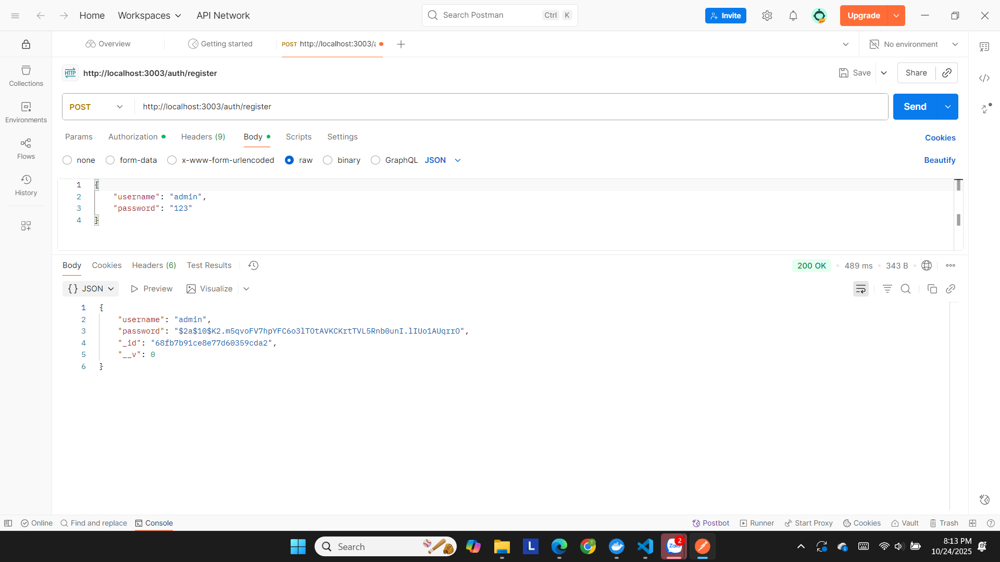
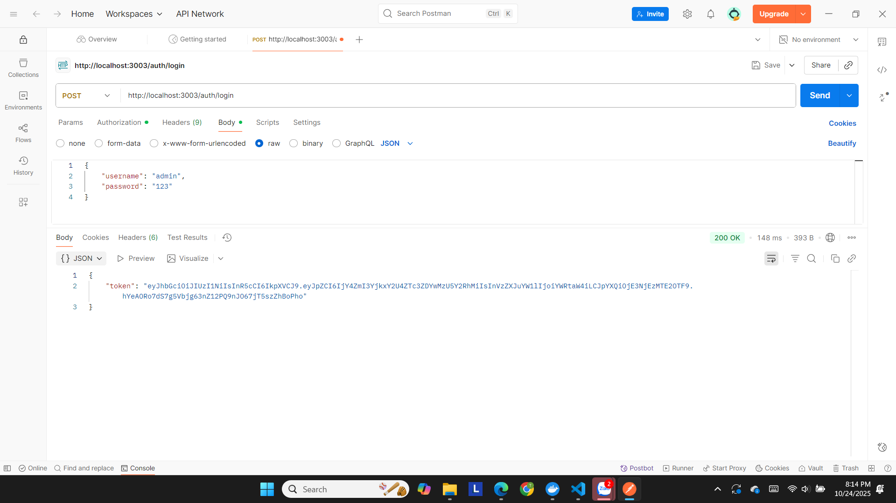
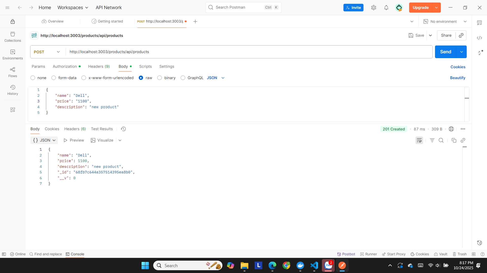
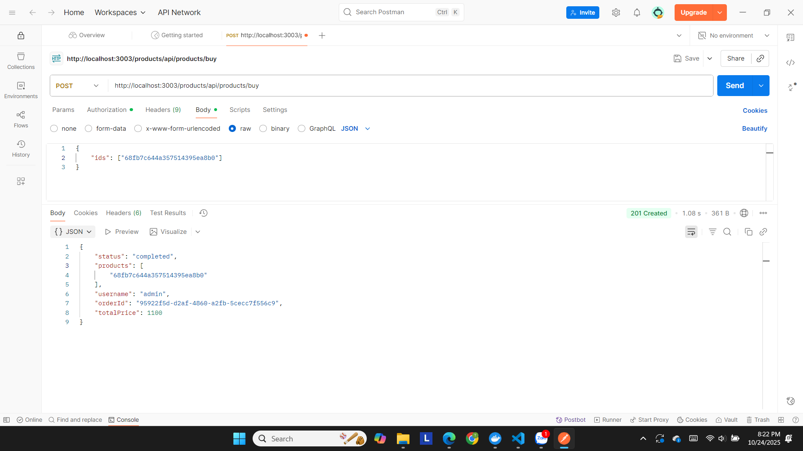

# 🧩 **BÁO CÁO DỰ ÁN EPROJECT - HỆ THỐNG THƯƠNG MẠI ĐIỆN TỬ THEO KIẾN TRÚC MICROSERVICES**

## I. **Giới thiệu chung**

Dự án EProject được xây dựng nhằm mô phỏng **một hệ thống thương mại điện tử phân tán**, trong đó các chức năng được **tách thành nhiều dịch vụ độc lập (microservices)**.
Hệ thống được phát triển bằng **Node.js**, sử dụng **MongoDB** để lưu trữ dữ liệu, **RabbitMQ** để trao đổi thông điệp giữa các dịch vụ, và **Docker Compose** để triển khai toàn bộ môi trường tự động.

### 🎯 Mục tiêu

* Xây dựng hệ thống có khả năng **mở rộng linh hoạt** và **triển khai độc lập** từng dịch vụ.
* Hiểu và áp dụng mô hình **Microservices Architecture** thực tế.
* Đảm bảo các dịch vụ có thể giao tiếp qua **HTTP REST API** và **message queue (RabbitMQ)**.
* Tích hợp cơ chế **xác thực JWT** để bảo vệ dữ liệu người dùng.

---

## II. **Kiến trúc hệ thống**

### 1. **Mô hình tổng quan**

Hệ thống bao gồm 4 dịch vụ chính cùng các thành phần hỗ trợ:

| Dịch vụ / Thành phần | Chức năng chính                                                       | Cổng mặc định |
| -------------------- | --------------------------------------------------------------------- | ------------- |
| **Auth Service**     | Xử lý đăng ký, đăng nhập, xác thực người dùng qua JWT.                | 3000          |
| **Product Service**  | Quản lý sản phẩm, phát sự kiện khi sản phẩm thay đổi qua RabbitMQ.    | 3001          |
| **Order Service**    | Tiếp nhận đơn hàng, tiêu thụ sự kiện sản phẩm từ RabbitMQ.            | 3002          |
| **API Gateway**      | Cổng vào duy nhất của client, định tuyến request đến các service con. | 3003          |
| **MongoDB**          | Lưu trữ dữ liệu cho từng service.                                     | 27017         |
| **RabbitMQ**         | Bộ hàng đợi thông điệp (Message Broker).                              | 5672 / 15672  |

---

### 2. **Sơ đồ hoạt động tổng quát**

```
[ Client ] 
   ↓
[ API Gateway ]
   ├──> Auth Service → MongoDB (authdb)
   ├──> Product Service → MongoDB (productdb)
   └──> Order Service → MongoDB (orderdb)
                     ↕
                RabbitMQ Broker
```

* Các **yêu cầu HTTP** đi qua API Gateway.
* Các **sự kiện bất đồng bộ** (như khi tạo sản phẩm, cập nhật đơn hàng) được gửi và nhận qua **RabbitMQ**.
* Mỗi service có thể được mở rộng hoặc triển khai độc lập.

---

### 3. **Kiến trúc Microservices**

Mỗi service hoạt động độc lập, có **database riêng**, **API riêng**, và **Docker container riêng**.
Các service giao tiếp với nhau bằng hai cơ chế:

1. **HTTP REST API** – sử dụng giữa Gateway ↔ các service.
2. **RabbitMQ Message Queue** – dùng cho việc phát và nhận sự kiện giữa Product ↔ Order.

Ví dụ:

* Khi **Product Service** tạo sản phẩm mới → gửi sự kiện `"product_created"` qua RabbitMQ.
* **Order Service** lắng nghe hàng đợi `"product_queue"` để cập nhật dữ liệu liên quan đến sản phẩm.

---

## III. **Phân tích hoạt động từng dịch vụ**

### 🔐 **1. Auth Service**

* Xử lý **đăng ký** và **đăng nhập**.
* Phát hành **JWT token** cho người dùng hợp lệ.
* Token này được gửi kèm header `"Authorization: Bearer <token>"` trong các request tiếp theo.

---

### 🛍️ **2. Product Service**

* Quản lý dữ liệu sản phẩm (tên, giá, mô tả,…).
* Mỗi khi thêm/sửa sản phẩm, service sẽ **phát sự kiện qua RabbitMQ** để các service khác cập nhật trạng thái.

### 📦 **3. Order Service**

* Tiếp nhận đơn hàng từ người dùng.
* Kiểm tra tồn kho thông qua RabbitMQ.
* Lưu đơn hàng vào MongoDB.

### 🌐 **4. API Gateway**

* Là **cổng vào duy nhất** của toàn hệ thống.
* Nhận request từ client và định tuyến đến các service con.
* Giúp ẩn chi tiết nội bộ, tăng bảo mật và kiểm soát truy cập.

**Ví dụ định tuyến:**

| Endpoint Gateway | Dịch vụ xử lý   |
| ---------------- | --------------- |
| `/auth/...`      | Auth Service    |
| `/products/...`  | Product Service |
| `/orders/...`    | Order Service   |

---

## IV. **Công nghệ và công cụ sử dụng**

| Công nghệ                   | Mục đích sử dụng                               |
| --------------------------- | ---------------------------------------------- |
| **Node.js / Express.js**    | Framework backend chính cho các microservice   |
| **MongoDB**                 | CSDL phi quan hệ dùng cho từng dịch vụ         |
| **RabbitMQ**                | Message broker – giúp truyền thông bất đồng bộ |
| **JWT (JSON Web Token)**    | Bảo mật và xác thực người dùng                 |
| **Docker & Docker Compose** | Quản lý và triển khai toàn bộ hệ thống         |
| **Mocha + Chai**            | Thư viện kiểm thử tự động                      |
| **Postman**                 | Dùng để kiểm thử API thủ công                  |

---

## V. **Cấu hình và triển khai hệ thống**

Hệ thống được triển khai bằng **Docker Compose**, cho phép khởi tạo đồng thời tất cả dịch vụ (Auth, Product, Order, API Gateway, MongoDB và RabbitMQ) chỉ với một lệnh duy nhất.
Mỗi dịch vụ có file **`.env` riêng** để khai báo các biến môi trường như `PORT`, `MONGODB_URI`, `RABBITMQ_URI`, và `JWT_SECRET`.

### 🔧 **Bước 1: Cấu hình môi trường**

* Tạo các file `.env` vào từng thư mục dịch vụ (`auth`, `product`, `order`, `api-gateway`).
* Đảm bảo RabbitMQ sử dụng thông tin:

  ```
  RABBITMQ_DEFAULT_USER=app
  RABBITMQ_DEFAULT_PASS=app
  ```

### 🐳 **Bước 2: Khởi chạy hệ thống**

Mở terminal tại thư mục gốc và chạy:

```bash
docker compose up --build
```

* API Gateway hoạt động tại: **[http://localhost:3003](http://localhost:3003)**
* Giao diện quản lý RabbitMQ: **[http://localhost:15672](http://localhost:15672)**
  (Tài khoản: `guest` / Mật khẩu: `guest`)

### 🧹 **Bước 3: Dừng toàn bộ container**

```bash
docker compose down
```

> 💡 *Lưu ý:* Nếu RabbitMQ chưa sẵn sàng khi các service khởi động, có thể tăng giá trị `RABBITMQ_CONNECT_DELAY_MS` trong file `.env` để tránh lỗi kết nối.

---

## VI. **Kiểm thử hệ thống (Postman)**

### 🧪 1. Kiểm thử chức năng Auth

**Đăng ký tài khoản**

```
POST /auth/register
Body: {
  "username": "admin",
  "password": "123"
}
```

*(Ảnh minh họa Postman: đăng ký thành công)*

**Đăng nhập**

```
POST /auth/login
Body: {
  "username": "admin",
  "password": "123"
}
```

Trả về JWT token → sử dụng cho các request khác.
*(Ảnh minh họa Postman: đăng nhập thành công)*


**Xem thông tin dashboard**


---

### 🛍️ 2. Kiểm thử Product

**Tạo sản phẩm**

```
POST /products
Header: Authorization: Bearer <JWT_TOKEN>
Body: {
  "name": "Dell",
  "price": "1100",
  "description":"new product"

}
```

*(Ảnh minh họa Postman: tạo sản phẩm thành công)*

**Xem danh sách sản phẩm**

*(Ảnh minh họa Postman: danh sách sản phẩm)*


### 📦 3. Kiểm thử Order

**Tạo đơn hàng**

*(Ảnh minh họa Postman: tạo đơn hàng thành công)*


## VII. **Phân tích hệ thống và đánh giá**

| Tiêu chí                 | Phân tích                                                       |
| ------------------------ | --------------------------------------------------------------- |
| **Tính mô-đun**          | Mỗi dịch vụ hoạt động độc lập, dễ mở rộng và bảo trì.           |
| **Khả năng chịu tải**    | RabbitMQ giúp hệ thống hoạt động ổn định khi lượng request lớn. |
| **Bảo mật**              | JWT bảo vệ tất cả các endpoint yêu cầu xác thực.                |
| **Triển khai linh hoạt** | Docker Compose giúp khởi chạy nhanh toàn bộ môi trường.         |
| **Khả năng mở rộng**     | Có thể nhân bản từng service và sử dụng load balancer.          |

---

## VIII. **Kết luận**

Hệ thống đã hoàn thiện theo đúng kiến trúc **Microservices**, gồm các module chính:

* **Auth**: xác thực người dùng, bảo mật bằng JWT.
* **Product**: quản lý sản phẩm, gửi sự kiện sang RabbitMQ.
* **Order**: xử lý đơn hàng, nhận sự kiện từ RabbitMQ.
* **API Gateway**: quản lý luồng dữ liệu và định tuyến API.
